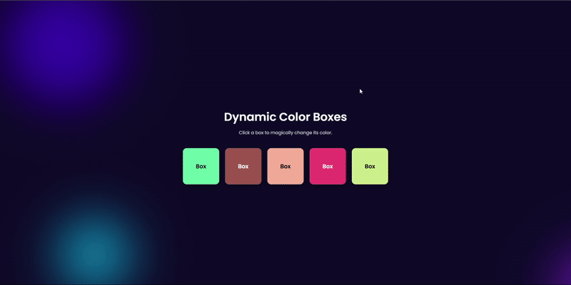

# Sigma Web Development - Exercise 12: Interactive Color Boxes

This is my final project for the Sigma Web Development course. It's an interactive web application that demonstrates advanced HTML, CSS, and JavaScript concepts to create a beautiful and dynamic user experience.

---

## 🚀 Project Features & Concepts

This project goes beyond the basic requirements to showcase a high level of front-end development skill.

-   **Modern UI/UX:** A stunning interface featuring a "Glassmorphism" design for the boxes and a beautiful, animated gradient "blob" background.
-   **Advanced JavaScript Logic:**
    -   **Dynamic Color Generation:** Clicking any box assigns it a new, random background color.
    -   **Smart Text Contrast:** A custom JavaScript function (`getContrastColor`) automatically checks the brightness of the random background and sets the text color to either black or white to ensure it's always readable. This is a key principle of accessible design (a11y).
-   **Advanced CSS Animations:** The project uses CSS `@keyframes` for the background blobs and staggered fade-in animations for the boxes, creating a polished and professional feel.
-   **Clean Code Organization:** All HTML, CSS, and JavaScript are organized into separate files, following best practices for maintainable code.

## 🛠️ Tech Stack

-   **HTML5**
-   **CSS3** (Flexbox, Glassmorphism, Advanced Animations, Custom Properties)
-   **JavaScript (ES6+)** (DOM Manipulation, Event Listeners, Custom Functions)

## 🎉 Course Complete!

A huge thank you to **CodeWithHarry** for the incredible **Sigma Web Development Course**. I've learned an immense amount and I am excited to continue growing as a developer. This final project is a testament to the skills I've gained.
